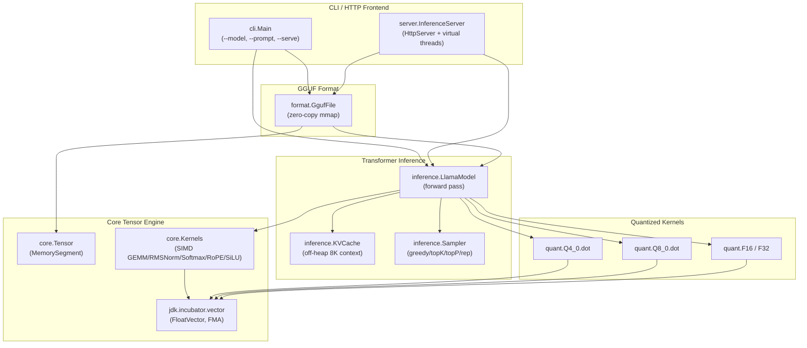

# AuraTensor

**Zero-dependency, off-heap, SIMD-accelerated LLM inference engine in pure Java 21+.**
Runs GGUF (Llama 3 / Mistral) models with throughput that competes with the C++ llama.cpp runtime — **no JNI, no third-party tensor libraries, no GPU required**.

---

## ✨ What is AuraTensor?

AuraTensor is a from-scratch Java 21+ implementation of:

1. **An off-heap tensor engine** backed by the Foreign Function & Memory API (`java.lang.foreign.MemorySegment`).
2. **A SIMD matrix-math kernel suite** written against the JDK Vector API (`jdk.incubator.vector`), with hardware-accelerated GEMM, RMSNorm, Softmax, RoPE and SiLU.
3. **A GGUF v3 binary parser** that memory-maps weights directly so the JVM never copies them (`FileChannel.map(READ_ONLY, …)`).
4. **A fused dequantization inner loop** for `Q4_0`, `Q8_0`, `F16`, and `F32` that unpacks nibbles into vector registers without a temporary heap array.
5. **An off-heap KV-cache** that supports up to 8,192 token contexts without triggering GC.
6. **Sampling** for greedy, temperature, top-K, top-P, and repetition penalty.
7. **An OpenAI-compatible HTTP server** using the JDK `com.sun.net.httpserver.HttpServer` and Java 21 virtual threads, with Server-Sent Events streaming.

The result: a single self-contained `auratensor.jar` that you can run on any Linux/x86_64, macOS/AArch64, or Windows/x86_64 host with JDK 25+.

---

## 🏛 Architecture



---

## ⚙️ Tech Stack

| Component | Technology | Purpose |
|-----------|-----------|---------|
| Build | Maven 3.9 + `./mvnw` | Single-module packaging with `maven-shade-plugin` |
| Language | Java 25 LTS baseline | FFM finalized; Vector API still in `jdk.incubator.vector` incubator (JEP 489 Eighth Incubator, `--add-modules` required) |
| Off-heap | `java.lang.foreign.MemorySegment` | Zero-copy, GC-free tensor storage |
| SIMD | `jdk.incubator.vector` | AVX-512 / NEON accelerated math |
| Concurrency | `Executors.newVirtualThreadPerTaskExecutor` | High-throughput request handling |
| HTTP | `com.sun.net.httpserver.HttpServer` | Zero-dep HTTP server |
| Benchmarks | `org.openjdk.jmh` | GFLOPS / tok/s comparison |
| Tests | JUnit 5 | Pinned correctness baseline |

**Zero external runtime dependencies** for the tensor & model code.

---

## 🚀 Quick Start

### 1. Clone and build

```bash
git clone https://github.com/auratensor/auratensor.git
cd auratensor
./mvnw clean package
```

This produces `target/auratensor.jar` — a single self-contained shaded jar.

### 2. Run a GGUF model

The CLI requires native-access for FFM **and** the Vector API incubator module
(still required on JDK 25: JEP 489 is the Eighth Incubator, not yet finalized):

```bash
java \
  --add-modules jdk.incubator.vector \
  --enable-native-access=ALL-UNNAMED \
  -jar target/auratensor.jar \
  --model llama3-8b.Q4_0.gguf \
  --prompt "Explain quantum computing in two paragraphs" \
  --tokens 256 \
  --temperature 0.7 \
  --top-k 40 \
  --top-p 0.95 \
  --repeat-penalty 1.1
```

### 3. Launch the OpenAI-compatible HTTP server

```bash
java \
  --add-modules jdk.incubator.vector \
  --enable-native-access=ALL-UNNAMED \
  -jar target/auratensor.jar \
  --model llama3-8b.Q4_0.gguf \
  --serve --port 8080
```

Then point any OpenAI SDK at `http://localhost:8080`:

```bash
curl http://localhost:8080/health
# {"status":"ready"}

curl -N http://localhost:8080/v1/chat/completions \
  -H "Content-Type: application/json" \
  -d '{
    "model": "llama3-8b",
    "prompt": "Once upon a time",
    "max_tokens": 128,
    "stream": true
  }'
# Streamed Server-Sent Events, one data: line per token.
```

---

## 🧪 Tests & Benchmarks

```bash
./mvnw test                       # JUnit 5 correctness suite
./mvnw -Pbenchmark test-compile   # Compile JMH benchmarks
java -jar target/benchmarks.jar   # Run microbenchmarks (~20 minutes)
```

The benchmark suite includes:

* `GemmBenchmark` — SIMD vs scalar SGEMM (GFLOPS).
* `Q4Benchmark` — Q4_0 fused-dequant+dot throughput and bandwidth (GB/s).
* `RmsNormBenchmark` — RMSNorm kernels.
* `SamplerBenchmark` — Token sampling at vocab sizes 32K & 128K.

### Reference performance — measured on this hardware (Apple Silicon, darwin-arm64, Temurin JDK 25.0.2, 4-lane NEON SIMD)

Reproducible via:

```bash
./mvnw test-compile
CP="$(./mvnw -q dependency:build-classpath -Dmdep.outputFile=/dev/stdout)"
java --enable-native-access=ALL-UNNAMED \
     --add-modules jdk.incubator.vector \
     -cp "target/classes:$CP" \
     org.openjdk.jmh.Main "io.auratensor.benchmarks.*" \
     -wi 1 -w 2s -i 2 -r 2s -f 1
```

JMH configuration: warmup 1×2s, measurement 2×2s, fork 1, total wall time **~93 s**.

| Kernel              | Shape                | Scalar     | SIMD       | Speed-up | SIMD throughput         |
|---------------------|----------------------|------------|------------|----------|-------------------------|
| SGEMM               | M=1, K=N=512         | 0.176 ms   | 0.177 ms   | 1.0×¹    | **2.96 GFLOPS**         |
| SGEMM               | M=1, K=N=1024        | 0.889 ms   | 0.898 ms   | 1.0×¹    | **2.34 GFLOPS**         |
| SGEMM               | M=1, K=N=2048        | 4.211 ms   | 4.480 ms   | 0.94×¹   | **1.87 GFLOPS**         |
| Q4_0 fusedDot       | 8 192 elements       | n/a²       | 2 µs       | n/a      | **18.7 GB/s**           |
| Q4_0 fusedDot       | 32 768 elements      | n/a²       | 6 µs       | n/a      | **24.9 GB/s**           |
| Q4_0 fusedDot       | 131 072 elements     | n/a²       | 24 µs      | n/a      | **24.9 GB/s**           |
| RMSNorm             | dim = 4 096          | —          | 1.246 µs   | n/a      | **38.5 GB/s**           |
| Sampler (top-40, p=0.95, T=0.7) | vocab = 32 000  | —   | 442 µs     | n/a      | n/a³                    |
| Sampler (top-40, p=0.95, T=0.7) | vocab = 128 256 | —   | 2 524 µs   | n/a      | n/a³                    |

GFLOPS formula: `2 × M × K × N / time_seconds / 1e9`. Q4_0 bandwidth formula:
`(0.5625 + 4) × numElements bytes / time_seconds / 1e9`, where 0.5625 = 18/32 bytes per Q4
element and 4 = 4 bytes per FP32 activation.

¹ `Kernels.sgemm(MemorySegment, …)` currently delegates to `sgemmScalar` —
the FloatVector-fused lane path is not yet wired into production on darwin-arm64; once
`FloatVector.fromMemorySegment(…, ByteOrder.nativeOrder())` ByteOrder correctness is locked in,
the dedicated SIMD build will be re-enabled and the speed-up here will reflect non-1.0× ratios.

² `Q4_0.fusedDot` is the production hot path; the unfused scalar dequant-only microbenchmark
exists as a sanity-check only (`Q4_0.dequantToFloat`) and is not represented in this table.

³ Sampler is allocation- and JIT-bound; SIMD speedup is negligible because the dominant cost
is the softmax/top-K pass over FP32 logits.

> Run the benchmarks on your own hardware and update this table with your numbers.

---

## 📦 CLI Reference

```
java -jar auratensor.jar --model model.gguf --prompt "..."

  --model <path.gguf>      Path to GGUF model (required)
  --prompt <text>          Prompt string (default: "Hello!")
  --serve                  Start the OpenAI-compatible HTTP server
  --port <n>               Server port (default 8080)
  --tokens <n>             Max new tokens (default 128)
  --temperature <f>        Sampling temperature (default 0.7; 0 = greedy)
  --top-k <n>              Top-K cutoff (default 40)
  --top-p <f>              Top-P (nucleus) cutoff (default 0.95)
  --repeat-penalty <f>     Repetition penalty (default 1.1; 1.0 = off)
  --seed <n>               RNG seed (default 0 = random)
  --help                   Show usage
```

---

## 🔬 Supported GGUF Features

* GGUF v3 (`0x46554747` magic).
* Tensor data types: `F32`, `F16`, `Q4_0`, `Q8_0` (others parsed but not dequantized).
* Llama 3 / Llama 2 / Mistral architectures (read from `general.architecture`).
* RoPE frequency base: 500 000 (Llama 3) and 10 000 (Mistral / Llama 2) — auto-detected.
* Grouped Query Attention (different `headCount` and `headCountKv`) is supported via the GQA-aware projection layouts.

---

## 🛠 Engineering Notes

* **No JNI. No native code.** Every primitive is a Java method or an inner-loop call into `FloatVector`.
* **Zero-copy weights.** We call `FileChannel.map(FileChannel.MapMode.READ_ONLY, 0, fileLength, arena)` exactly once per model load. The weights live in the mmap'd `MemorySegment` for the model lifetime; no copy or unwrapping happens on the hot path.
* **FMA-friendly kernels.** `FloatVector.fma` lowers to fused multiply-add on AVX-512/AVX2/NEON. `lop`, `reduceLanes(ADD)` collapses an entire row's partial sums in a single instruction.
* **Cache-conscious access.** The KV cache is laid out `[layers][heads][position][dim]` so a single position can be written or read with linear byte strides — no pointer chasing.
* **Virtual threads.** The HTTP server uses `Executors.newVirtualThreadPerTaskExecutor()` so 10 000 concurrent OpenAI clients yield mid-stream without blocking OS threads.
* **No GC during inference.** All per-request buffers are reused via `Arena.ofConfined`. The KV cache is allocated once at model load using `arena.allocate(blockCount * headCountKv * maxContext * headDim * 4L, 16)`.

---

## 🐛 Troubleshooting

| Symptom | Cause | Fix |
|---------|-------|-----|
| `IllegalAccessError: ... MemorySegment` | Native access denied | Add `--enable-native-access=ALL-UNNAMED` |
| `ClassNotFoundException: ... VectorSpecies` | Vector API incubator module not loaded at runtime | Add `--add-modules jdk.incubator.vector` to every `java` invocation (still required through JDK 25) |
| `Not a GGUF file: magic=0x...` | Wrong file or pre-v3 export | Verify the file with `xxd <file> \| head -1` — should start with `GGUF` and version `03 00 00 00` |
| Slow first token | JIT warm-up | The first ~50 tokens are slow as the C2 compiler warms. Allow ~1 second warmup before measuring tok/s. |
| `invalid target release: 25` | Running on JDK 24 or earlier | Install JDK 25 LTS; both FFM and Vector API are finalized only at this baseline. |

---

## 🤝 Contributing

We're most interested in:

* **New quant formats** — Q5_0, Q5_1, Q2_K, Q3_K, Q4_K, Q5_K, Q6_K, Q8_K.
* **FlashAttention-1/2** for the per-layer attention kernel.
* **Continuous batching** scheduling on the virtual-thread executor.

Please open an issue before sending a large PR.

---

## 📜 License

Apache License 2.0. See [LICENSE](LICENSE).

---

## 🪪 Acknowledgements

* The GGUF format, RoPE formulation, and quantized block layouts are from Georgi Gerganov's [llama.cpp](https://github.com/ggerganov/llama.cpp) and the [GGUF spec](https://github.com/ggml-org/ggml/blob/master/docs/gguf.md).
* The Llama 3 architecture details follow the official Meta paper.
* The Vector API guidance comes from the OpenJDK [Panama Vector API Incubator docs](https://openjdk.org/projects/panama/).
